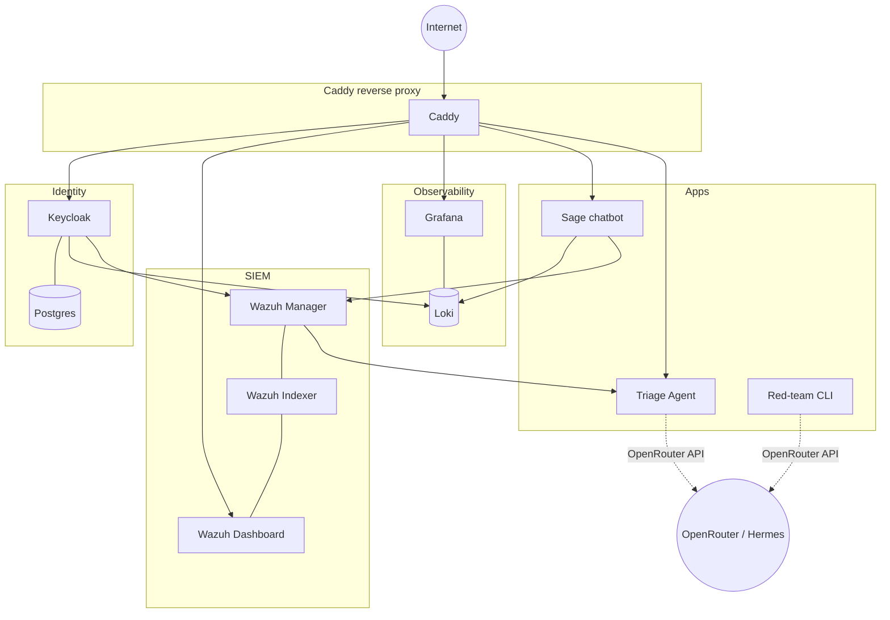

# Architecture

## Host

One Oracle Cloud Always Free Ampere A1 ARM VM:

- Up to 4 OCPUs / 24 GB RAM (we use the full allocation)
- Ubuntu 24.04 LTS
- 200 GB block storage from the free pool
- One public IPv4 + Caddy-managed Let's Encrypt TLS

Fallback: Hetzner CAX11 ($5/month) if Oracle's free-tier ARM capacity is unavailable.

## Service topology

## Why each component

| Component | Why it's here |
|---|---|
| Caddy | Auto-TLS, one config file, no ACME plumbing to maintain |
| Wazuh | The closest open-source equivalent of Sentinel — manager, indexer, dashboard, rules engine, agent-based collection |
| Keycloak | Real OIDC/SAML — needed to make UNC3944 OAuth/MFA scenarios authentic |
| Loki + Grafana | App logs that aren't security-relevant don't belong in Wazuh; Loki absorbs them |
| Sage chatbot | The deliberately vulnerable target. Without it, the AI security story has nothing to attack |
| Triage agent | The blue-side LLM. Investigates alerts and proposes rule tuning |
| Red-team agent | The red-side LLM planner + scenario executors |
| OpenRouter | Single API for many models. Hermes default; A/B against Claude/GPT/Qwen/Llama for the eval story |

## Data flows

### Attack → detection → triage

1. Red-team scenario runs (e.g. MFA fatigue against Keycloak)
2. Keycloak emits events → Wazuh manager
3. Wazuh rules match → alert generated
4. Wazuh integrator calls the triage webhook (POST `/webhook/wazuh`)
5. Triage agent sanitizes the alert, gathers evidence (Loki + Wazuh API)
6. Triage agent sends the bundle to OpenRouter
7. Model returns validated `TriageResult` JSON
8. Triage agent persists the verdict to `triage-incidents.jsonl`

### Eval (scoring blue against red)

1. Red-team's `ground_truth.jsonl` records what red *actually did*
2. Eval harness pulls (alert, triage_result, ground_truth) triples
3. Scores: did blue identify the right MITRE techniques? severity? actor? FP-call?
4. Writes per-model CSV to `metrics/`
5. Grafana dashboard reads the CSV to visualize blue accuracy across models

## Resource budget on the free tier

| Service | RAM | CPU notes |
|---|---|---|
| Wazuh indexer | 1.5 GB | Most expensive component |
| Wazuh manager | 0.8 GB | |
| Wazuh dashboard | 0.6 GB | Can stop when not actively viewing |
| Keycloak + Postgres | 1.2 GB | Steady |
| Loki | 0.4 GB | |
| Grafana | 0.3 GB | |
| Caddy | 0.05 GB | Negligible |
| Sage | 0.3 GB | Spikes during LLM calls (but call goes to OpenRouter) |
| Triage agent | 0.3 GB | Spikes during LLM calls |
| Headroom | ~18 GB | For OS, buffer cache, occasional red-team containers |

Comfortable on 4 OCPU / 24 GB. Tight but workable on 2 OCPU / 12 GB if Oracle gives you the smaller allocation.

## What's intentionally NOT in scope

- No Kubernetes. Docker Compose is enough for one VM.
- No service mesh. East-west traffic is plain TCP on the compose network.
- No centralized secrets manager. `.env` + GitHub Actions secrets.
- No multi-tenant anything.
- No production-grade backups. The lab is reproducible from code; data is throwaway.
