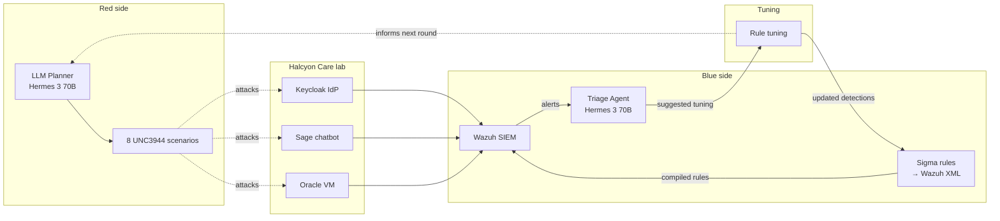

# Project Healyx (OSS Edition)

> A self-improving purple-team SOC lab on Oracle Cloud Free Tier, built entirely with open source tooling.

## The feedback loop

## What this is

A solo portfolio project modeling **Halcyon Care Pte Ltd**, a fictional 25-person Singaporean healthcare-SaaS. Red attacks, blue detects, the triage agent proposes detection tuning, the rules sharpen, and the red side adapts.

## The stack at a glance

- **Host:** Oracle Cloud Always Free ARM VM
- **SIEM:** Wazuh
- **Identity:** Keycloak
- **Observability:** Grafana + Loki
- **Detections:** Sigma → Wazuh XML
- **LLM API:** OpenRouter, default Nous Hermes 3 70B
- **Targets:** Sage (vulnerable chatbot) + the lab VM itself

## Where to start

- New to the project? Read [Architecture](architecture.md) and [Scope](scope.md).
- Starting a build session? Open the [weekly playbook](weeks/week-01-bootstrap.md) for the week you're on.
- Migrating from the Azure version? See the [pivot guide](https://github.com/justinkok28/Healyx/blob/main/PIVOT_FROM_AZURE.md) in the repo root.
